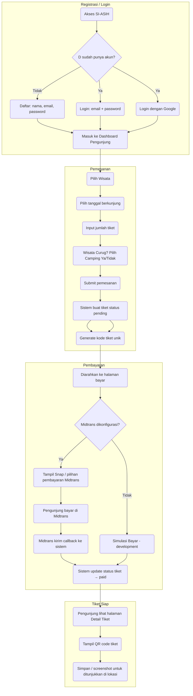
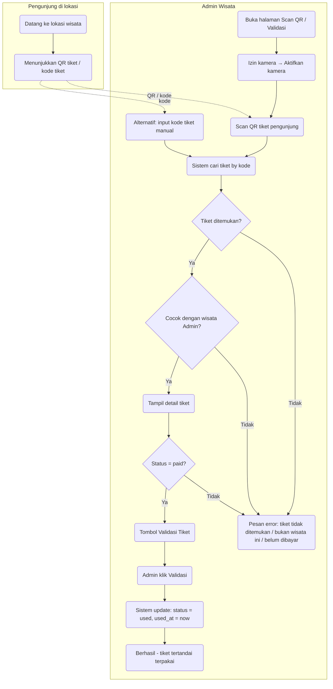
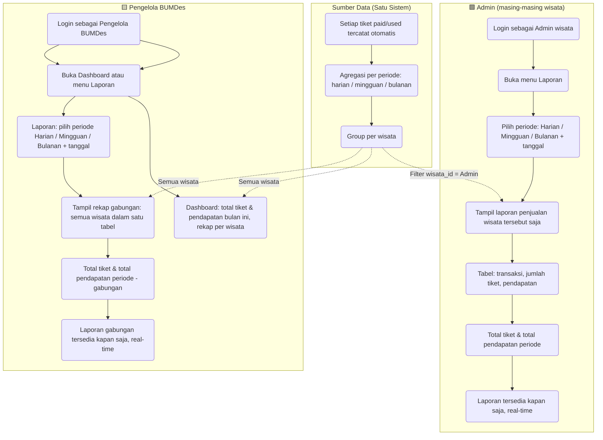

# Proses Bisnis SI-ASIH (Sistem Informasi Tiket Wisata)

Dokumen ini mendeskripsikan **proses bisnis yang diusulkan** dari sistem SI-ASIH secara rinci, serta perbandingannya dengan proses yang sedang berjalan.

---

## Daftar Isi

1. [Ringkasan Sistem dan Peran](#1-ringkasan-sistem-dan-peran)
2. [Proses Bisnis Pemesanan dan Pembayaran Tiket](#2-proses-bisnis-pemesanan-dan-pembayaran-tiket)
3. [Proses Bisnis Validasi Tiket di Lokasi](#3-proses-bisnis-validasi-tiket-di-lokasi)
4. [Proses Bisnis Pelaporan](#4-proses-bisnis-pelaporan)
5. [Integrasi Eksternal dan Real-Time](#5-integrasi-eksternal-dan-real-time)
6. [Perbandingan: Saat Ini vs Diusulkan](#6-perbandingan-saat-ini-vs-diusulkan)
7. [Cara Melihat Diagram (Mermaid)](#7-cara-melihat-diagram-mermaid)

---

## 1. Ringkasan Sistem dan Peran

### 1.1 Tujuan Sistem

SI-ASIH adalah sistem informasi tiket wisata yang mendukung:

- Pemesanan tiket **secara online** oleh pengunjung.
- Pembayaran **online** (Midtrans) atau **simulasi** (pengembangan).
- Tiket **digital berbasis QR code** yang divalidasi di lokasi wisata.
- **Laporan penjualan** per wisata (Admin) dan **laporan gabungan** semua wisata (Pengelola BUMDes).
- Pembaruan data **real-time** antar semua peran tanpa jeda (polling 1,5 detik).

### 1.2 Peran (Role) dan Hak Akses

| Peran | Deskripsi | Hak Akses Utama |
|-------|-----------|------------------|
| **Pengunjung** | Calon pengunjung wisata yang memesan tiket | Daftar/Login (email atau Google), pilih wisata, pesan tiket, bayar, lihat tiket saya, tampilkan QR tiket |
| **Admin (per wisata)** | Petugas wisata yang melayani validasi tiket di lokasi | Dashboard wisata, scan QR / cari kode tiket, validasi tiket (tandai terpakai), laporan penjualan wisata tersebut |
| **Pengelola BUMDes** | Pengelola gabungan (semua wisata) | Dashboard gabungan, laporan penjualan semua wisata (filter harian/mingguan/bulanan) |

- Setiap **Admin** terhubung ke **satu wisata** (`wisata_id`). Hanya tiket untuk wisata tersebut yang dapat divalidasi dan dilaporkan oleh Admin tersebut.
- **Pengelola BUMDes** melihat data **agregat** dari semua wisata (Curug Cibarebeuy, Puncak Pasir Ipis, Bukit Panineungan/Spot Foto, dll.).

### 1.3 Status Tiket

| Status | Arti |
|--------|------|
| **pending** | Tiket baru dibuat; menunggu pembayaran |
| **paid** | Sudah dibayar (via Midtrans atau simulasi); boleh divalidasi di lokasi |
| **used** | Sudah divalidasi di lokasi (masuk wisata) |
| **cancelled** | Dibatalkan (ditolak/expire/cancel dari Midtrans) |

---

## 2. Proses Bisnis Pemesanan dan Pembayaran Tiket

### 2.1 Alur Lengkap (Pengunjung)

Proses yang diusulkan untuk **pengunjung** dari awal hingga memiliki tiket yang siap ditunjukkan di lokasi:

**Rincian langkah:**

| No | Langkah | Rincian |
|----|---------|---------|
| 1 | Akses SI-ASIH | Pengunjung membuka website (home). Informasi wisata dan harga tampil di beranda. |
| 2 | Daftar / Login | Daftar dengan nama, email, password; atau login dengan email/password; atau **Login dengan Google** (OAuth). Role otomatis: pengunjung. |
| 3 | Pilih wisata & isi form | Dari menu "Pesan Tiket" pengunjung memilih wisata → form: tanggal berkunjung, jumlah tiket. Untuk wisata Curug Cibarebeuy: wajib pilih Camping (Ya/Tidak). Total harga = harga tiket × jumlah (parkir dibayar terpisah di lokasi). |
| 4 | Submit pemesanan | Sistem membuat record **Tiket** (status: pending), generate **kode tiket** unik (contoh: SI-XXXXXXXX). Jika Midtrans tersedia, sistem buat transaksi Midtrans dan dapat **snap token**. |
| 5 | Halaman bayar | Jika Midtrans aktif: tampil Snap (payment page Midtrans). Pengunjung memilih metode bayar dan menyelesaikan pembayaran. Jika tidak: tampil tombol **Simulasi Bayar** (development). |
| 6 | Konfirmasi pembayaran | **Midtrans** mengirim **POST** ke endpoint callback sistem (`/payment/notification`). Sistem verifikasi signature, cek status transaksi (capture/settlement + fraud accept → paid; deny/expire/cancel → cancelled). Status tiket di-update. Simulasi: langsung update status → paid. |
| 7 | Tiket siap | Pengunjung dapat melihat **Detail Tiket** (status Sudah Dibayar). **QR code** ditampilkan (generate dari kode/isi tiket). Pengunjung menyimpan/screenshot untuk ditunjukkan di lokasi. |

### 2.2 Integrasi Pembayaran (Midtrans)

- **Alur:** Aplikasi → buat transaksi Snap → pengunjung bayar di Midtrans → Midtrans **callback** ke server SI-ASIH → sistem update status tiket.
- **Endpoint callback:** `POST /payment/notification` (CSRF dikecualikan). Payload berisi `order_id`, `transaction_status`, `fraud_status`, `signature_key`, dll.
- **Verifikasi:** Sistem menghitung `sha512(order_id + status_code + gross_amount + server_key)` dan membandingkan dengan `signature_key` dari Midtrans.
- **Status yang dianggap lunas:** `transaction_status` = capture atau settlement, dan `fraud_status` = accept → tiket di-set **paid**.
- **Ngrok (development):** Untuk testing callback dari internet, URL notification di Midtrans Dashboard diisi dengan URL ngrok (mis. `https://xxxx.ngrok-free.app/payment/notification`).

---

## 3. Proses Bisnis Validasi Tiket di Lokasi

### 3.1 Alur Validasi (Admin Wisata)

Setelah pengunjung datang ke lokasi wisata, **Admin** (petugas wisata) memvalidasi tiket agar status berubah menjadi **used** dan pengunjung diizinkan masuk.

**Rincian langkah:**

| No | Langkah | Rincian |
|----|---------|---------|
| 1 | Buka halaman validasi | Admin login → menu **Scan QR** → halaman validasi. Tampil area kamera dan form input kode manual. |
| 2 | Izin kamera | Untuk scan QR, sistem meminta **izin kamera** (hanya untuk situs ini). Pengunjung klik "Izinkan & Aktifkan Kamera". Di HP bisa ganti kamera depan/belakang. |
| 3 | Scan QR atau input kode | **Scan:** library html5-qrcode membaca QR dari kamera; teks hasil (kode tiket) otomatis dikirim ke form cari. **Manual:** Admin ketik kode tiket (contoh: SI-ABCD1234) lalu submit. |
| 4 | Cari tiket | Sistem mencari tiket dengan `kode_tiket` = input. Jika tidak ditemukan → pesan error. |
| 5 | Cek wisata | Tiket memiliki `wisata_id`. Admin memiliki `wisata_id`. Jika tiket bukan untuk wisata Admin → error "Tiket ini bukan untuk wisata Anda". |
| 6 | Tampil detail | Tampil: kode tiket, wisata, pemesan, jumlah, tanggal berkunjung, status. Jika wisata Curug + camping: tampil keterangan camping. |
| 7 | Validasi | Hanya jika status = **paid**, tombol **Validasi Tiket (Tandai Sudah Terpakai)** aktif. Admin klik → sistem update `status = 'used'`, `used_at = now()`. Redirect ke halaman scan dengan pesan sukses. |

---

## 4. Proses Bisnis Pelaporan (2 Aktor: Admin & Pengelola BUMDes)

Pelaporan melibatkan **dua aktor** yang saling melengkapi: **Admin (per wisata)** dan **Pengelola BUMDes**. Berikut proses yang sedang berjalan dan yang diusulkan.

---

### 4.1 Proses yang Sedang Berjalan (Saat Ini)

Pelaporan saat ini **manual dan terpusat**; satu Admin menangani pencatatan, lalu Pengelola BUMDes menerima laporan.

| **Admin (Wisata)** | **Pengelola BUMDes** |
|--------------------|----------------------|
| Mulai | |
| Mencatat pembelian tiket (buku) | |
| Mencatat pemasukan harian | |
| Membuat laporan bulanan | |
| Laporan (dokumen fisik) | Laporan (menerima / akses) |
| Map arsip | Selesai |

**Ciri proses saat ini:**

- Satu Admin (atau per lokasi) menangani pencatatan pembelian dan pemasukan harian.
- Laporan bulanan dibuat manual (dokumen).
- Laporan disimpan di map arsip (fisik).
- Pengelola BUMDes **menerima** atau **mengakses** laporan yang sudah jadi; tidak input data langsung.

---

### 4.2 Proses yang Diusulkan (SI-ASIH) — 2 Aktor dalam Satu Alur

Dalam SI-ASIH, **sumber data pelaporan satu**: tiket yang sudah dibayar/divalidasi. **Admin** dan **Pengelola BUMDes** sama-sama melakukan **pelaporan** (melihat laporan) langsung dari sistem, dengan cakupan berbeda.

**Ringkasan peran kedua aktor:**

| Aspek | Admin (per wisata) | Pengelola BUMDes |
|-------|---------------------|-------------------|
| **Aksi** | Melakukan **pelaporan** dengan melihat laporan wisata sendiri | Melakukan **pelaporan** dengan melihat laporan gabungan semua wisata |
| **Sumber data** | Tiket paid/used **wisata yang menjadi tanggung jawab Admin** | Tiket paid/used **semua wisata** |
| **Tampilan** | Laporan satu wisata (filter periode + tanggal) | Dashboard bulan berjalan + Laporan gabungan (filter periode + tanggal) |
| **Pencatatan** | Tidak input manual; sistem mencatat otomatis dari tiket yang dibayar & divalidasi | Tidak input manual; sistem agregasi dari data yang sama |

Kedua aktor **langsung** mengakses laporan dari sistem; tidak ada tahap “Admin buat dokumen → serah ke Pengelola”. Data mengalir dari **satu sumber** (database tiket) ke **dua tampilan** (per wisata untuk Admin, gabungan untuk Pengelola).

---

### 4.3 Rincian Langkah per Aktor (Proses Diusulkan)

#### Aktor 1: Admin (per wisata)

| No | Langkah | Rincian |
|----|---------|---------|
| 1 | Login | Admin login dengan akun yang terhubung ke **satu wisata** (`wisata_id`). |
| 2 | Buka Laporan | Menu **Laporan** → halaman laporan wisata tersebut. |
| 3 | Pilih periode & tanggal | Pilih **Periode**: Harian / Mingguan / Bulanan. Pilih **Tanggal** referensi. Data tampil **otomatis** (tanpa tombol Tampilkan); ganti periode/tanggal → data berubah. |
| 4 | Lihat hasil | Tabel: kolom transaksi, jumlah tiket, pendapatan. Baris total tiket & total pendapatan. Hanya data **wisata Admin**. Data di-refresh **real-time** (polling 1,5 detik). |

#### Aktor 2: Pengelola BUMDes

| No | Langkah | Rincian |
|----|---------|---------|
| 1 | Login | Pengelola login dengan role **pengelola_bumdes**. |
| 2 | Dashboard | Lihat **total tiket bulan ini** (semua wisata), **total pendapatan bulan ini**, dan **tabel rekap per wisata** (nama wisata, jumlah tiket bulan ini, pendapatan bulan ini). Data real-time. |
| 3 | Buka Laporan | Menu **Laporan** → halaman laporan gabungan. |
| 4 | Pilih periode & tanggal | Pilih **Periode**: Harian / Mingguan / Bulanan. Pilih **Tanggal**. Data tampil otomatis. |
| 5 | Lihat hasil | Tabel: **per wisata** (nama wisata, transaksi, jumlah tiket, pendapatan). Baris **total** di bawah. Data **gabungan semua wisata**. Real-time. |

---

### 4.4 Perbandingan Pelaporan: Saat Ini vs Diusulkan

| Aspek | Saat ini | Diusulkan (SI-ASIH) |
|-------|----------|----------------------|
| **Pencatatan pembelian** | Manual di buku oleh Admin | **Otomatis** saat tiket dibayar & divalidasi (satu sumber data) |
| **Pemasukan harian** | Dicatat manual | Tersedia di filter laporan **Harian** (Admin & Pengelola) |
| **Pembuat / pengakses laporan** | Satu Admin buat → Pengelola terima | **Admin**: laporan per wisata; **Pengelola**: laporan gabungan; keduanya **langsung** akses sistem |
| **Jenis periode** | Bulanan (eksplisit) | **Harian, Mingguan, Bulanan** (pilihan filter untuk kedua aktor) |
| **Arsip** | Map arsip fisik | **Digital** di sistem; akses kapan saja |
| **Pengelola BUMDes** | Menerima laporan dari Admin | **Akses langsung** laporan gabungan dari sistem (tanpa menunggu serah terima dokumen) |

Dengan demikian, **proses bisnis pelaporan** tetap melibatkan **2 aktor (Admin dan Pengelola BUMDes)** seperti di wisata yang Anda maksud: Admin fokus pada laporan **wisatanya**, Pengelola pada **laporan gabungan**; bedanya keduanya melakukan pelaporan **langsung** dari satu sistem yang sama, tanpa tahap manual “buat laporan → serah ke Pengelola”.

---

## 5. Integrasi Eksternal dan Real-Time

### 5.1 Integrasi yang Digunakan

| Integrasi | Fungsi | Keterangan |
|-----------|--------|------------|
| **Midtrans** | Pembayaran online | Snap token untuk pembayaran; callback `POST /payment/notification` untuk update status tiket (paid/cancelled). |
| **Google OAuth** | Login dengan Google | Hanya untuk role pengunjung (pendaftaran/login). Redirect URI harus sesuai (localhost atau domain publik; .test tidak diterima Google). |
| **QR Code** | Tiket digital | Generate QR dari kode/isi tiket (BaconQrCode atau API eksternal). Ditampilkan di halaman detail tiket setelah status paid/used. |

### 5.2 Perilaku Real-Time (Tanpa Jeda)

Sistem dirancang agar perubahan data **langsung terlihat** di semua role dengan **polling 1,5 detik** (tanpa WebSocket):

| Halaman | Role | Perilaku real-time |
|---------|------|---------------------|
| Tiket Saya | Pengunjung | Daftar tiket di-refresh; kolom status (Pending/Paid/Used) diperbarui otomatis. |
| Detail Tiket | Pengunjung | Status dicek tiap 1,5 detik; jika berubah ke paid/used, halaman di-reload sekali agar QR dan status tampil benar. |
| Dashboard Pengelola | Pengelola BUMDes | Total tiket bulan ini, total pendapatan, dan tabel rekap per wisata di-refresh tiap 1,5 detik. |
| Laporan Pengelola | Pengelola BUMDes | Filter periode/tanggal → data via AJAX; tambahan polling 1,5 detik untuk refresh data di background (tanpa loading saat auto-refresh). |
| Dashboard Admin | Admin | Tiket hari ini, tiket bulan ini, pendapatan bulan ini di-refresh tiap 1,5 detik. |

**Alur integrasi antar role:**

- Pembayaran lunas (Midtrans callback atau simulasi) → status tiket = **paid** → dalam maksimal ~1,5 detik pengunjung melihat status terbaru di Tiket Saya/Detail; Admin dan Pengelola melihat angka terbaru di dashboard/laporan.
- Admin validasi tiket → status = **used** → dalam maksimal ~1,5 detik pengunjung melihat status "Sudah Terpakai" di daftar/detail tiket.

---

## 6. Perbandingan: Saat Ini vs Diusulkan

### 6.1 Pemesanan Tiket

| Aspek | Proses yang sedang berjalan | Proses yang diusulkan (SI-ASIH) |
|-------|-----------------------------|----------------------------------|
| Pemesanan | Hanya di lokasi, tatap muka | **Online**: pilih wisata, tanggal, jumlah (dan camping jika Curug) |
| Registrasi / Login | Tidak ada (langsung bayar) | **Daftar/Login** (email atau Google) untuk akses pemesanan |
| Pembayaran | Tunai di lokasi | **Online** (Midtrans) atau **Simulasi** (development) |
| Tiket | Fisik (kertas) | **Digital + QR code** (ditampilkan di HP) |
| Pencatatan | Manual di buku | **Otomatis** di database (status pending → paid → used) |
| Validasi di lokasi | Serah terima tiket fisik | Admin **scan QR** atau **input kode** → **validasi** di sistem → status used |

### 6.2 Validasi di Lokasi

| Aspek | Saat ini | Diusulkan (SI-ASIH) |
|-------|----------|----------------------|
| Identifikasi tiket | Tiket fisik | **QR code** atau **kode tiket** (contoh: SI-XXXXXXXX) |
| Pengecekan | Visual / manual | Sistem cek: tiket ada, cocok wisata, status paid → boleh validasi |
| Pencatatan terpakai | Manual (jika ada) | Sistem update **status = used**, **used_at**; tercatat untuk laporan |

### 6.3 Pelaporan

| Aspek | Saat ini | Diusulkan (SI-ASIH) |
|-------|----------|----------------------|
| Sumber data | Catatan manual / buku | **Otomatis** dari tiket paid/used |
| Pembuat laporan | Satu Admin (sentral) | **Per wisata**: masing-masing Admin lihat laporan wisatanya |
| Jenis periode | Bulanan (eksplisit) | **Harian, Mingguan, Bulanan** (filter + tanggal) |
| Pengelola BUMDes | Menerima laporan fisik/dokumen | **Akses langsung** dashboard & laporan gabungan semua wisata |
| Arsip | Map arsip fisik | **Digital** di sistem, akses kapan saja; data real-time |

### 6.4 Ringkasan Singkat

| | Pemesanan Tiket | Validasi | Pelaporan |
|---|------------------|----------|-----------|
| **Saat ini** | Datang → bayar tunai → terima tiket fisik → Admin catat di buku | Serah terima tiket fisik | Admin catat pembelian & pemasukan → laporan bulanan → arsip → Pengelola terima laporan |
| **Diusulkan (SI-ASIH)** | Pesan online → bayar online/Simulasi → terima tiket QR → datang → Admin scan QR / input kode → validasi → sistem catat | Scan QR atau kode → cek wisata & status paid → klik Validasi → status used | Sistem catat otomatis → Admin buka laporan per wisata (filter periode) → Pengelola buka dashboard & laporan gabungan; semua real-time |

---

## 7. Cara Melihat Diagram (Mermaid)

Diagram di dokumen ini ditulis dalam format **Mermaid**. Cara melihat:

- **GitHub / GitLab:** File `.md` akan merender diagram Mermaid otomatis.
- **VS Code:** Pasang ekstensi "Markdown Preview Mermaid Support", lalu buka preview file ini.
- **Online:** Salin blok kode Mermaid ke [Mermaid Live Editor](https://mermaid.live), lalu export PNG/SVG jika perlu untuk presentasi atau dokumen.

---

*Dokumen proses bisnis SI-ASIH — Sistem Informasi Tiket Wisata BUMDes Cipta Asih Desa Cibeusi.*
